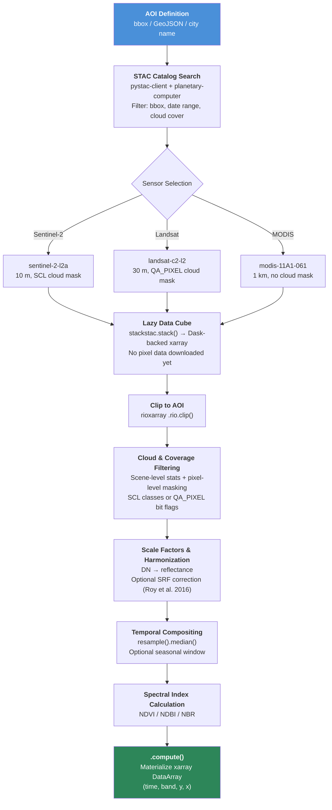
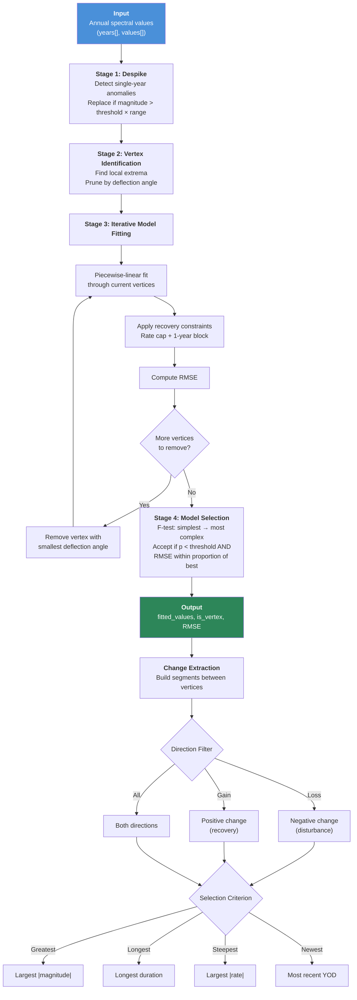
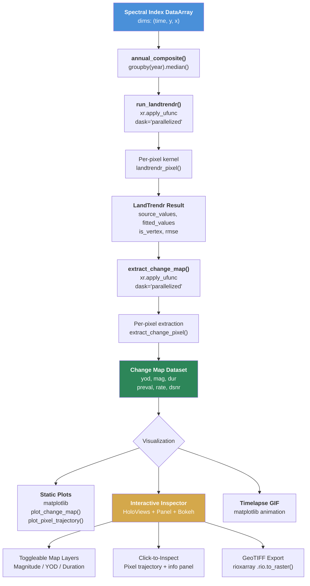

# Space-Time-DeepSearch: A Python Library for Cloud-Native Satellite Time Series Analysis and LandTrendr Temporal Segmentation

**Abstract** — This report presents Space-Time-DeepSearch, an open-source Python library that simplifies spatiotemporal analysis of satellite imagery using modern geospatial standards and parallel computing. The library provides a single API for retrieving multi-sensor satellite data (Landsat, Sentinel-2, MODIS) via SpatioTemporal Asset Catalogs (STAC) and Cloud-Optimized GeoTIFFs (COG), and includes the first native Python implementation of the LandTrendr temporal segmentation algorithm (Kennedy et al., 2010). This implementation runs independently of Google Earth Engine, giving users full transparency, extensibility, and integration with the Python scientific stack. We describe the library architecture, validate the native LandTrendr against the established GEE reference implementation, and demonstrate its application across three distinct use cases. Version 1.0 covers data extraction modules, LandTrendr temporal segmentation, and interactive visualization tools.

---

## Table of Contents

1. [Introduction](#1-introduction)
2. [Related Work](#2-related-work)
3. [Architecture](#3-architecture)
4. [GEE vs Native LandTrendr: A Systematic Comparison](#4-gee-vs-native-landtrendr-a-systematic-comparison)
5. [Use Cases](#5-use-cases)
6. [Implementation](#6-implementation)
7. [Conclusions](#7-conclusions)
8. [References](#8-references)

---

## 1. Introduction

### 1.1 Research Context

A researcher wants to run LandTrendr on a custom spectral index over a small study area. The only production-ready implementation lives inside Google Earth Engine. That means writing JavaScript, accepting GEE's compositing decisions, and exporting results before they can enter a Python analysis pipeline. For anyone working within the Python geospatial ecosystem, this detour is a recurring problem.

The raw data, meanwhile, has never been more accessible. Missions like Landsat (four decades of continuous coverage) and Sentinel-2 (10-meter resolution since 2015) produce dense time series that capture landscape dynamics ranging from sudden forest clearing to gradual glacial retreat. Standards like SpatioTemporal Asset Catalogs (STAC) and Cloud-Optimized GeoTIFFs (COG) let analysts search, filter, and stream this imagery directly from cloud archives, no bulk downloads required. Platforms like Microsoft Planetary Computer, NASA Earthdata, and Element 84's Earth Search host petabytes of satellite data behind standardized APIs.

Yet the most widely used temporal analysis workflows still depend on GEE. GEE delivers scalability and convenience, but its closed-source, server-side execution creates real friction: you cannot step through the algorithm, swap out compositing logic, or plug results into a PyTorch training loop without first exporting them. For research that demands reproducibility or customization, this is a bottleneck.

### 1.2 Motivation

Space-Time-DeepSearch addresses three concrete gaps:

1. **No native Python LandTrendr.** LandTrendr (Kennedy et al., 2010) is among the most widely used temporal segmentation algorithms for land change detection. Its only production implementation lives inside GEE, which means researchers cannot inspect, modify, or debug it at the pixel level without reverse-engineering the server-side behavior.

2. **Fragmented tooling.** Good Python libraries exist for each piece of the satellite analysis pipeline: `pystac-client` for catalog search, `stackstac` for lazy data cubes, `xarray` for labeled arrays, `rioxarray` for raster operations. Combining them into a working workflow still requires considerable boilerplate and domain knowledge.

3. **No interactive pixel inspection.** Interpreting temporal segmentation results means clicking on pixels, examining their trajectories, and understanding how the algorithm partitioned each time series. Outside of GEE's code editor, this capability does not exist in a ready-to-use form.

### 1.3 Research Questions

This work addresses the following questions:

1. Can a native Python pipeline, built on STAC and xarray, produce satellite data retrieval and temporal segmentation results comparable to Google Earth Engine?
2. How does a pure-NumPy LandTrendr implementation, parallelized via `xr.apply_ufunc` and Dask, compare against GEE's server-side processing in terms of accuracy and flexibility?
3. What are the practical trade-offs between the two approaches in scalability, reproducibility, and extensibility?

### 1.4 Scope

Version 1.0 covers three capabilities: (1) multi-sensor data extraction for Landsat, Sentinel-2, and MODIS with cloud-aware filtering and temporal compositing; (2) a complete LandTrendr temporal segmentation engine with change map extraction; and (3) visualization tools including static plots, interactive pixel inspection, and timelapse animation. Future versions will add deep learning models for automated change classification.

---

## 2. Related Work

### 2.1 LandTrendr Temporal Segmentation

LandTrendr (Landsat-based Detection of Trends in Disturbance and Recovery) was introduced by Kennedy et al. (2010) as a method for fitting piecewise-linear models to annual Landsat time series. The algorithm identifies breakpoints (vertices) in spectral trajectories, making it possible to detect and characterize land surface change events. It works in four stages: despiking to remove ephemeral anomalies, vertex identification to locate candidate breakpoints, iterative model fitting from complex to simple configurations, and statistical model selection via F-testing. Since publication, LandTrendr has been widely adopted for forest disturbance mapping, post-fire recovery assessment, and urban expansion detection.

### 2.2 Google Earth Engine Implementation

Kennedy et al. (2018) ported LandTrendr to Google Earth Engine as `ee.Algorithms.TemporalSegmentation.LandTrendr`, adding cloud-compute scalability and direct access to GEE's Landsat archives. The LT-GEE implementation is now used for national and continental-scale mapping. But its server-side execution model means users cannot step through the algorithm, modify internal logic, or feed results into Python-native workflows without exporting data first. GEE's compositing approach also differs from band-level compositing: it computes the spectral index per scene, then takes the median. Because normalized difference indices are non-linear, this produces systematically different results from computing band medians first, then the index.

### 2.3 Cloud-Native Geospatial Standards

STAC (SpatioTemporal Asset Catalogs) and COG (Cloud-Optimized GeoTIFFs) have reshaped how satellite data gets accessed and processed. STAC provides a standardized JSON-based specification for describing geospatial assets, allowing catalog search across providers through a common API. COGs store GeoTIFF data with internal tiling and overviews so that HTTP range requests can read only the needed portions of a file, eliminating bulk scene downloads. Microsoft Planetary Computer hosts petabytes of satellite data (Landsat Collection 2, Sentinel-2 L2A, MODIS) behind STAC endpoints, making it a practical alternative to GEE for data access.

### 2.4 The Python Geospatial Stack

Several Python libraries form the backbone of modern cloud-native geospatial analysis:

- **xarray** (Hoyer & Hamman, 2017) provides labeled, N-dimensional arrays that attach coordinate metadata (time, latitude, longitude) to NumPy arrays, making satellite data cubes self-describing and interoperable.
- **Dask** (Rocklin, 2015) extends NumPy and pandas with lazy, parallel, and out-of-core computation. Combined with xarray, it handles datasets larger than memory by partitioning arrays into chunks processed in parallel.
- **stackstac** turns STAC items into lazy Dask-backed DataArrays, with automatic reprojection and mosaicing.
- **rioxarray** extends xarray with rasterio-based geospatial operations: CRS management, clipping to geometries, and reprojection.

### 2.5 Where Space-Time-DeepSearch Fits

Space-Time-DeepSearch ties these components into a single library covering the full pipeline from data discovery through temporal analysis to visualization. The central contribution is the native Python LandTrendr implementation: a pure-NumPy kernel that is fully transparent, unit-testable, and debuggable at the pixel level. By running on STAC-accessed data through xarray and Dask, the library delivers GEE-comparable functionality while staying within the open Python ecosystem.


*Figure 1: Conceptual diagram showing how Space-Time-DeepSearch integrates cloud-native data access (STAC/COG), the Python scientific stack (xarray/Dask), and temporal segmentation (LandTrendr) into a single pipeline.*

---

## 3. Architecture

Space-Time-DeepSearch is organized into three layers: data ingestion (`io/`), temporal analysis (`temporal/`), and visualization (`vis/`). A single `SpaceTimeDeepSearch` class in `core.py` exposes all functionality through one API, accepting an area of interest (AOI) as a bounding box, custom geometry, or city name.

### 3.1 Data Retrieval Pipeline

The data retrieval pipeline takes an area of interest and time range and produces an analysis-ready xarray DataArray with dimensions `(time, band, y, x)`. Three sensor-specific modules handle different data sources, each following the same architectural pattern.

#### Supported Data Sources

| Module | Collection | Sensors | Resolution | Cloud Masking |
|--------|-----------|---------|------------|---------------|
| `sentinel2.py` | Sentinel-2 L2A | MSI (13 bands) | 10 m | SCL classification layer |
| `landsat.py` | Landsat C2 L2 | TM, ETM+, OLI, OLI-2 | 30 m | QA_PIXEL bit flags |
| `modis.py` | MOD11A1 v061 | MODIS Terra | 1000 m | Not available in L2 LST |

#### Pipeline Stages

The retrieval pipeline moves through eight stages, all operating lazily until the final materialization step:

1. **AOI Definition.** The user provides a bounding box `(west, south, east, north)` in WGS-84, a GeoJSON file path, a Shapely geometry, or a city name (geocoded via OpenStreetMap). The library picks the optimal UTM projection zone using `pyproj`.

2. **STAC Catalog Search.** The library connects to Microsoft Planetary Computer via `pystac-client` with automatic SAS token signing through the `planetary-computer` modifier. Scenes are queried by bounding box, date range, and coarse cloud cover metadata.

3. **Lazy Data Cube Construction.** Matching STAC items are assembled into a Dask-backed xarray DataArray via `stackstac.stack()`. This step sets up references to Cloud-Optimized GeoTIFF URLs without downloading any pixel data. For Landsat, the parameter `rescale=False` is critical: it prevents double application of scale factors already encoded in the STAC item metadata.

4. **Geometry Clipping.** For non-rectangular AOIs, the data cube is clipped to the target geometry using `rioxarray.clip()`. This operation is also lazy.

5. **Cloud and Coverage Filtering.** A two-pass filter removes unsuitable scenes. First, cloud statistics are computed per scene: for Sentinel-2 by decoding the Scene Classification Layer (SCL classes 3, 8, 9, 10), for Landsat by decoding QA_PIXEL bit flags (bits 1, 3, 4, 5). To speed this up, quality arrays are downsampled 10:1 for large AOIs. Scenes exceeding the cloud cover threshold or falling below the minimum spatial coverage are discarded. Second, pixel-level cloud masking sets remaining cloudy pixels to NaN.

6. **Scale Factor Application.** Landsat Collection 2 Level-2 data needs conversion from digital numbers to surface reflectance using the scale factor 0.0000275 and offset -0.2, followed by clipping to the valid [0, 1] range. An optional Spectral Response Function (SRF) correction (Roy et al., 2016) harmonizes TM and ETM+ reflectance to OLI-equivalent values.

7. **Temporal Compositing.** Scenes are aggregated into regular time periods (e.g., monthly or annual) using median compositing, which handles residual cloud contamination well. An optional seasonal window restricts compositing to specific months (e.g., June through October for growing season analysis).

8. **Materialization.** The lazy computation graph is executed via `.compute()`, downloading only the required data tiles and producing an in-memory xarray DataArray.


*Figure 2: Data retrieval pipeline from AOI definition to materialized xarray DataArray. Every operation between STAC search and `.compute()` is lazy. No pixel data is downloaded until the final step.*

### 3.2 LandTrendr Pixel-Level Algorithm

The temporal segmentation engine implements the Kennedy et al. (2010) algorithm as a pure-NumPy kernel in `_landtrendr_core.py`. This design keeps the algorithm independent of xarray, Dask, or any I/O framework, making it unit-testable with plain array inputs and compatible with JIT compilers like Numba.

The algorithm takes a time series of annual spectral values for a single pixel and returns a piecewise-linear fitted trajectory with identified breakpoints (vertices). It proceeds through four stages:

#### Stage 1: Despiking

Single-year anomalies, caused by residual cloud contamination, sensor noise, or atmospheric effects, are identified and removed. For each interior point in the time series, the algorithm checks whether both neighbors deviate in the same direction (i.e., the point is a local spike). If the spike magnitude exceeds the product of `spike_threshold` and the overall value range, the point is replaced with the average of its neighbors. Setting the threshold to 1.0 disables this step.

#### Stage 2: Vertex Identification

Candidate breakpoints are identified as local extrema: points where the direction of spectral change reverses. The first and last observations are always included. If the number of candidates exceeds the allowed maximum (`max_segments + 1 + vertex_count_overshoot`), an angle-based pruning strategy iteratively removes the vertex with the smallest deflection angle. The deflection angle measures how sharply the trajectory changes direction at a given vertex. Vertices with small angles represent minor inflections that add little to the overall shape.

#### Stage 3: Iterative Model Fitting

A sequence of models is built from most complex (all initial vertices) down to simplest (two vertices forming a single straight line). At each iteration:

1. A piecewise-linear curve is fitted through the current vertices using linear interpolation (`np.interp`).
2. **Recovery constraints** are applied: segments representing vegetation recovery are checked against two rules. If `prevent_one_year_recovery` is enabled, recovery segments spanning only one year are flattened. If the recovery rate (spectral change per year) exceeds `recovery_threshold`, the segment endpoint is adjusted to cap the rate.
3. The RMSE between the fitted curve and the original (despiked) values is computed.
4. The interior vertex with the smallest deflection angle is removed, and the process repeats.

This produces a collection of candidate models ranging from `max_segments` segments down to 1 segment.

#### Stage 4: Statistical Model Selection

The optimal model complexity is found by walking from simplest to most complex and applying an F-test against the null model (single straight line). The first model that meets two conditions is selected: (1) its F-test p-value falls below `pval_threshold`, confirming a statistically meaningful improvement over the null, and (2) its RMSE is within `best_model_proportion` of the best-fitting (most complex) model's RMSE. If no model meets both criteria, the simplest model is returned. This implements a parsimony principle: prefer simpler explanations unless the data justifies complexity.

#### Change Extraction

Once segmentation is complete, change metrics are derived from the fitted trajectory. Consecutive vertex pairs define segments, each characterized by: Year of Detection (YOD), magnitude, duration, pre-change value, rate (magnitude/duration), and delta signal-to-noise ratio (dSNR = |magnitude|/RMSE). A direction filter selects loss segments (negative spectral change, typically disturbance), gain segments (positive change, typically recovery), or both. A selection criterion then picks the segment of interest: greatest magnitude, longest duration, steepest rate, or most recent occurrence.


*Figure 3: LandTrendr pixel-level algorithm. The four stages transform a raw spectral time series into a piecewise-linear trajectory with identified breakpoints. Change extraction derives disturbance or recovery metrics from the fitted segments.*


*Figure 4: Example LandTrendr pixel trajectory showing source spectral values (gray dots), the piecewise-linear fitted trajectory (red line), and detected vertices (red triangles). The dashed gold vertical line marks the Year of Detection for the greatest-loss segment.*

### 3.3 Image-Level Disturbance Maps and Interactive Inspector

#### Parallelized Execution

The LandTrendr kernel operates on one pixel at a time. The library scales it to full images through `xr.apply_ufunc()` with `dask="parallelized"` and `vectorize=True`. This strips the time dimension from the input DataArray, loops the pixel-level function across all `(y, x)` positions, and distributes the workload across Dask workers. The result is an xarray Dataset with four variables: `source_values` and `fitted_values` (both `(time, y, x)`), `is_vertex` (boolean, `(time, y, x)`), and `rmse` (scalar per pixel, `(y, x)`).

An `annual_composite()` utility reduces sub-annual observations to one value per year using grouped median or mean, producing the annual time series that LandTrendr requires.

#### Change Map Extraction

The `extract_change_map()` function uses the same `xr.apply_ufunc` strategy to run `extract_change_pixel()` across all pixels. This produces a spatial dataset with six variables: Year of Detection (YOD), magnitude, duration, pre-change value, rate, and delta signal-to-noise ratio, each stored as a 2-D array with dimensions `(y, x)`. Users select the change type (greatest, longest, steepest, or newest) and direction filter (loss, gain, or all) to extract the segment of interest across the full landscape.

#### Interactive Inspector

The `LandTrendrInspector` class provides an interactive dashboard for exploring change maps and inspecting individual pixel trajectories. Built with HoloViews, Panel, and Bokeh, it renders in Jupyter notebooks or as a standalone web application. The interface has three parts:

- **Map panel (left).** Three toggleable raster layers (magnitude, Year of Detection, and duration) overlaid on an Esri satellite basemap. The library automatically reprojects change maps from their native UTM coordinate reference system to Web Mercator (EPSG:3857) for basemap alignment. Each layer uses an independent colormap computed from valid data ranges, with adjustable transparency.

- **Inspection panel (right).** Clicking any pixel on the map triggers a coordinate transformation from Web Mercator to the native CRS, retrieves the corresponding time series, and renders an interactive trajectory plot. The plot shows source spectral values as scatter points, the piecewise-linear fitted curve, vertex markers, and a vertical line at the Year of Detection. A companion panel displays coordinates, YOD, magnitude, duration, and RMSE.

- **Export controls.** A GeoTIFF export button writes each change map variable as a georeferenced raster via `rioxarray.rio.to_raster()`, preserving the original coordinate reference system.


*Figure 5: Image-level processing pipeline from spectral index input through parallelized LandTrendr execution, change map extraction, and the three visualization outputs. The interactive inspector (highlighted) supports click-to-inspect pixel trajectory analysis.*


*Figure 6: Screenshot of the LandTrendr Interactive Inspector. Left: magnitude change map overlaid on an Esri satellite basemap with toggleable layers for YOD and duration. Right: pixel trajectory plot for the selected pixel (white star) showing source values, fitted trajectory, vertices, and Year of Detection (dashed gold line), with coordinate and metric information displayed below.*

---

## 4. GEE vs Native LandTrendr: A Systematic Comparison

To validate the native Python implementation, we ran a systematic comparison against the well-established Google Earth Engine LandTrendr (LT-GEE). Both follow the Kennedy et al. (2010) algorithm but differ in data source, compositing method, index orientation, scale handling, and cloud masking approach.

### 4.1 Comparison Setup

Two ecologically distinct test sites were selected:

| Site | Coordinates | Expected Change Pattern |
|------|------------|------------------------|
| **Oregon forest** | -122.8848, 43.7929 | Abrupt disturbance ~1997 (harvest or fire) |
| **Brazil mining** | -56.61152, -6.84313 | Continuous degradation from mining activity |

Both implementations used identical LandTrendr parameters: `max_segments=6`, `spike_threshold=0.9`, `recovery_threshold=0.25`, `pval_threshold=0.25`, and `best_model_proportion=0.75`. The spectral index was NBR (Normalized Burn Ratio) over 1985 to 2024, with cross-sensor harmonization disabled on both sides.

The key structural differences:

| Factor | Native | GEE |
|--------|--------|-----|
| **Compositing** | `NBR(median(NIR), median(SWIR2))` | `median(NBR per scene)` |
| **Scale** | float64 [-1, 1] | int16 (x1000) |
| **Cloud masking** | Scene-level + pixel-level | Pixel-level only |

The compositing order matters most. The normalized difference is a non-linear operation, so computing band medians first and then calculating NBR gives mathematically different results from computing NBR per scene and then taking the median.

### 4.2 Key Findings

#### Pixel-Level Agreement

At both test sites, the native and GEE implementations detect the same disturbance events with strong trajectory correlation:

- **Oregon forest:** Pearson r = 0.93 between fitted trajectories. Both correctly identify the ~1997 abrupt disturbance (YOD = 1996) with 1-year duration. The native implementation measures a slightly larger magnitude (-0.81 vs -0.60), consistent with the compositing order difference.

- **Brazil mining:** Pearson r = 0.72. Both capture the long-term degradation trend with near-identical magnitudes (-0.36 vs -0.34). They differ in segment choice: GEE fits a 2-vertex model that captures the entire 39-year decline as one segment, while native identifies a recent steep segment.


*Figure 7: Overlay of native (red) and GEE (blue) fitted NBR trajectories at the Oregon forest test pixel. Both detect the ~1997 abrupt disturbance.*

#### Spatial Change Map Agreement

Over ~3 km areas of interest at each site:

| Metric | Oregon Forest | Brazil Mining |
|--------|--------------|---------------|
| Pixel trajectory r | 0.93 | 0.72 |
| YOD spatial r | 0.67 | 0.53 |
| YOD agreement (+/-1 yr) | 64.2% | 50.0% |
| Magnitude spatial r | 0.83 | 0.67 |
| Duration spatial r | 0.38 | 0.22 |
| Mean YOD (native / GEE) | 2003.8 / 2004.0 | 1996.8 / 1996.0 |

Mean YOD values show no systematic timing bias at either site, confirming both implementations identify changes in the same time periods. The native version consistently detects slightly larger magnitudes, which tracks with the compositing order effect. Duration shows lower correlation because minor differences in vertex placement disproportionately affect segment length, especially at gradual-change sites.


*Figure 8: Spatial change map comparison at the Oregon forest site. Rows: Native, GEE, Difference. Columns: Year of Detection, Magnitude, Duration. The difference maps use a diverging colormap centered on zero.*


*Figure 9: Cross-site scatter plots comparing native (y-axis) vs. GEE (x-axis) for Year of Detection, Magnitude, and Duration. Oregon pixels in green, Brazil in orange. Dashed line indicates 1:1 agreement.*

### 4.3 Sources of Divergence

Three factors account for the remaining differences:

**Compositing order (primary).** The native approach computes `NBR(median(NIR), median(SWIR2))`, while GEE computes `median(NBR_scene)`. Because the normalized difference is non-linear, these produce systematically different composite values. The effect is strongest when within-season spectral variability is high, and explains the consistent magnitude offset.

**Cloud masking scope.** The native implementation applies both scene-level cloud percentage filtering (rejecting entire scenes above a threshold) and pixel-level QA masking. GEE applies only pixel-level masking. Different scenes may therefore contribute to the annual composites, leading to different input time series.

**Numerical precision.** GEE operates on scaled int16 values (NBR x 1000), creating a quantization floor of 0.001 in NBR units. The native implementation uses float64 throughout. Rounding differences can shift vertex placement during the pruning step.

### 4.4 Recommendations

| Use Case | Recommended | Rationale |
|----------|------------|-----------|
| Large-area mapping (national/continental) | **GEE** | Cloud compute eliminates download/storage needs |
| Integration with Python geospatial stack | **Native** | Direct xarray/Dask workflow, composable |
| Custom spectral indices or compositing | **Native** | Full control over every processing step |
| Comparison with published GEE studies | **GEE** | Exact reproducibility with original methods |
| Offline or air-gapped environments | **Native** | Only needs STAC access or local data |
| Educational / debugging | **Native** | Transparent pure-NumPy kernel, step-through |

---

## 5. Use Cases

### 5.1 Deforestation Monitoring

> **[Placeholder]** This section will present a deforestation detection case study using Landsat time series and LandTrendr temporal segmentation over a tropical forest site. The analysis will show how the library detects abrupt canopy loss events, maps their spatial extent and timing, and quantifies disturbance magnitude. Content pending completion of analysis notebooks.


*Figure 10: [Placeholder] Deforestation change map showing Year of Detection and magnitude of canopy loss over the study area.*

### 5.2 Climate Change - Ice Decrease in Svalbard

> **[Placeholder]** This section will analyze glacial retreat and ice cover reduction in Svalbard using multi-decadal Landsat and Sentinel-2 imagery. The time series analysis will track changes in spectral indices that indicate ice-to-exposed-rock transitions, quantifying the rate and spatial pattern of glacial retreat over the satellite record. Content pending completion of analysis notebooks.


*Figure 11: [Placeholder] Time series of ice cover extent in Svalbard derived from satellite spectral indices, showing the temporal trajectory of glacial retreat.*

### 5.3 Phenological Cycles in Flevoland

> **[Placeholder]** This section will demonstrate NDVI-based phenological cycle analysis over agricultural land in Flevoland, the Netherlands, using Sentinel-2 time series. The analysis will show how temporal compositing and visualization tools capture seasonal vegetation dynamics, including green-up, peak growth, and senescence across different crop types. Content pending completion of analysis notebooks.


*Figure 12: [Placeholder] NDVI timelapse showing phenological cycles over agricultural parcels in Flevoland across a full growing season.*

---

## 6. Implementation

### 6.1 Installation

Space-Time-DeepSearch is installable via pip:

```bash
pip install space-time-deepsearch
```

For development and testing:

```bash
git clone https://github.com/your-org/space-time-deepsearch.git
cd space-time-deepsearch
poetry install --with dev
```

The library requires Python 3.11 or 3.12. On Windows, a known PROJ database conflict with PostgreSQL/PostGIS installations is handled automatically at import time.

### 6.2 Quick Start

A complete LandTrendr workflow runs in a few lines:

```python
from space_time_deepsearch import SpaceTimeDeepSearch

# Define area of interest
stds = SpaceTimeDeepSearch(city="Enschede, Netherlands")

# Retrieve annual Landsat NBR composites (1985-2024)
landsat = stds.get_landsat(
    start_date="1985-01-01", end_date="2024-12-31",
    bands=["nir08", "swir22"], add_nbr=True,
    cloud_cover_max=20, mask_clouds=True,
    composite_period="1Y",
    composite_start="06-01", composite_end="10-31",
)

# Extract NBR band and run LandTrendr
nbr = landsat.sel(band="NBR", drop=True)
lt_result = stds.run_landtrendr(nbr)

# Generate change map and launch interactive inspector
change = stds.extract_change_map(lt_result, change_type="greatest", delta_filter="loss")
stds.inspect_landtrendr(lt_result, change)
```

### 6.3 Documentation and Notebooks

> **[Placeholder]** API reference documentation will be generated via mkdocs-material and mkdocstrings and published online. Public Jupyter notebooks demonstrating complete workflows for each use case (deforestation, ice retreat, phenology) will be available in the repository's `notebooks/` directory.

---

## 7. Conclusions

### 7.1 What This Work Contributes

Space-Time-DeepSearch brings cloud-native satellite time series analysis and LandTrendr temporal segmentation into the open Python ecosystem. Four things stand out.

First, it is the **first native Python LandTrendr implementation**. Validation against the GEE reference shows pixel-level trajectory correlations of r = 0.72 to 0.93, and spatial Year of Detection agreement of 50 to 64% within one year, across two ecologically distinct test sites.

Second, it provides a **single data retrieval API** for Landsat, Sentinel-2, and MODIS through STAC and Cloud-Optimized GeoTIFFs. Cloud-aware filtering, temporal compositing, and spectral index calculation all run lazily via Dask.

Third, the **interactive pixel inspector** lets researchers explore change maps and examine individual pixel trajectories in a browser-based dashboard, connecting spatial overviews with per-pixel detail.

Fourth, the **algorithm kernel is pure NumPy**, suitable for unit testing, educational use, and potential acceleration via JIT compilation.

### 7.2 Trade-Offs

The native implementation gives you flexibility, reproducibility, and direct integration with the Python scientific stack. Researchers can swap the compositing strategy, add custom spectral indices, or plug LandTrendr into larger analysis pipelines. These are things that are difficult or impossible within GEE. On the other hand, GEE keeps its advantage for large-area mapping at national or continental scales, where server-side processing removes the need for local compute resources and data transfer.

### 7.3 Future Work

Planned directions for future releases:

- **Deep learning integration.** PyTorch is already a dependency, anticipating the addition of learned change classifiers that operate on LandTrendr-derived features.
- **Additional temporal algorithms.** Methods like BFAST and CCDC could be implemented as alternative kernels within the same xarray-based framework.
- **More data sources.** Integration with additional STAC providers and datasets (e.g., Sentinel-1 SAR, ERA5 climate reanalysis) would widen the library's analytical scope.
- **QGIS plugin.** A graphical interface for non-programmer users, bringing interactive LandTrendr analysis into the QGIS desktop environment.

---

## 8. References

- Hoyer, S., & Hamman, J. (2017). xarray: N-D labeled arrays and datasets in Python. *Journal of Open Research Software*, 5(1), 10.

- Kennedy, R. E., Yang, Z., & Cohen, W. B. (2010). Detecting trends in forest disturbance and recovery using yearly Landsat time series: 1. LandTrendr - Temporal segmentation algorithms. *Remote Sensing of Environment*, 114(12), 2897-2910.

- Kennedy, R. E., Yang, Z., Gorelick, N., Braaten, J., Cavalcante, L., Cohen, W. B., & Healey, S. (2018). Implementation of the LandTrendr algorithm on Google Earth Engine. *Remote Sensing*, 10(5), 691.

- Rocklin, M. (2015). Dask: Parallel computation with blocked algorithms and task scheduling. *Proceedings of the 14th Python in Science Conference*, 126-132.

- Roy, D. P., Kovalskyy, V., Zhang, H. K., Vermote, E. F., Yan, L., Kumar, S. S., & Egorov, A. (2016). Characterization of Landsat-7 to Landsat-8 reflective wavelength and normalized difference vegetation index continuity. *Remote Sensing of Environment*, 185, 57-70.

- STAC Specification. (2021). SpatioTemporal Asset Catalog specification. https://stacspec.org

---

*Report generated for Space-Time-DeepSearch v1.0. Author: David Reyes.*
