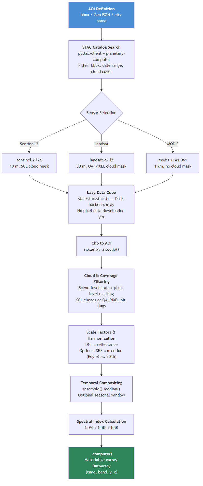
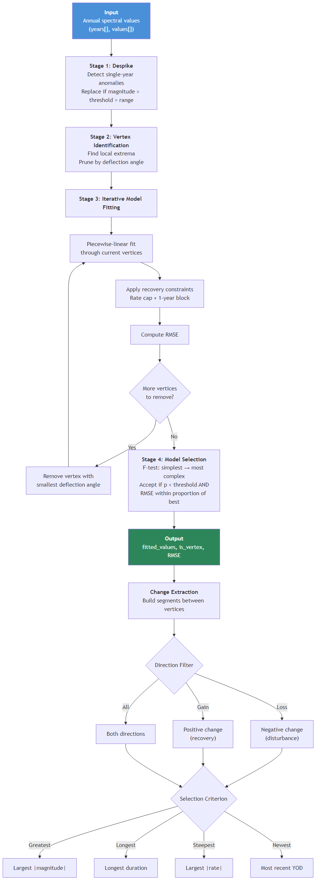
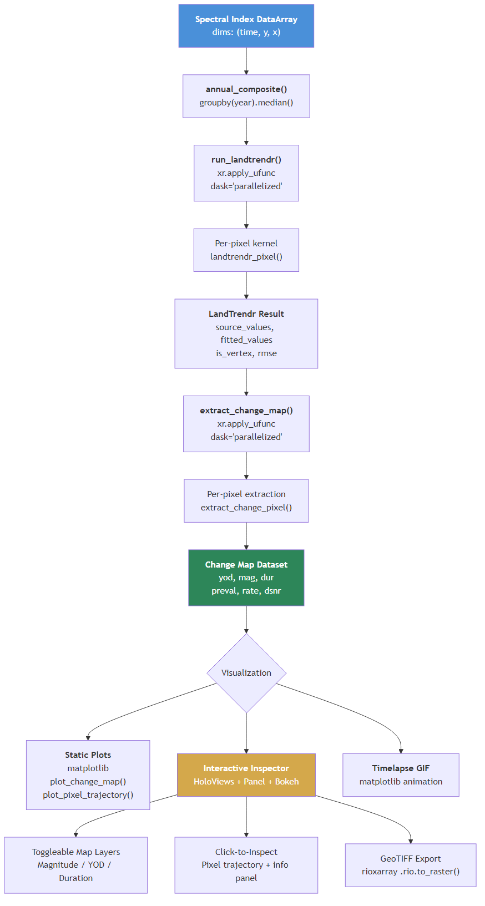
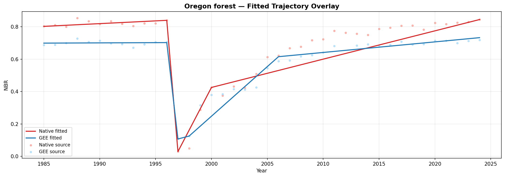
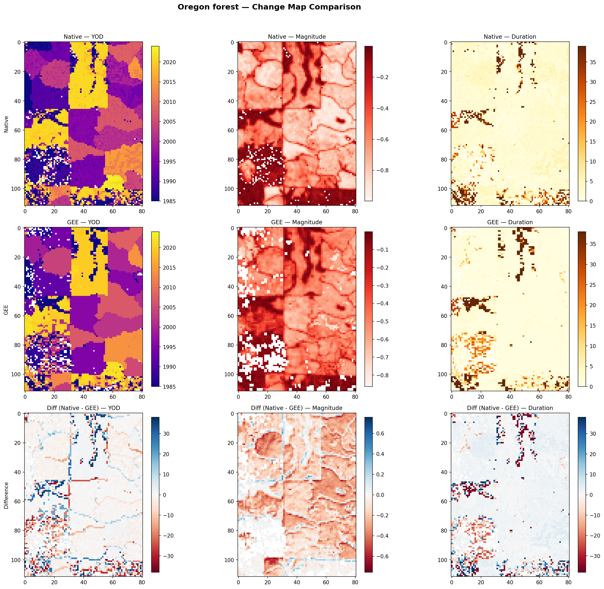
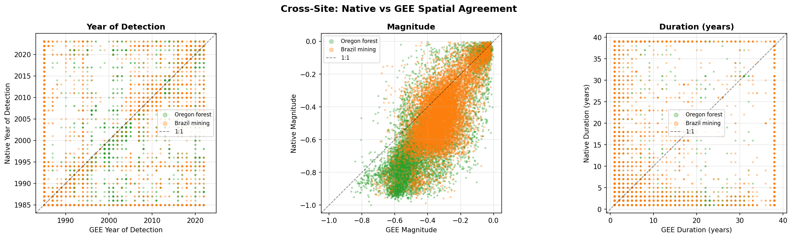
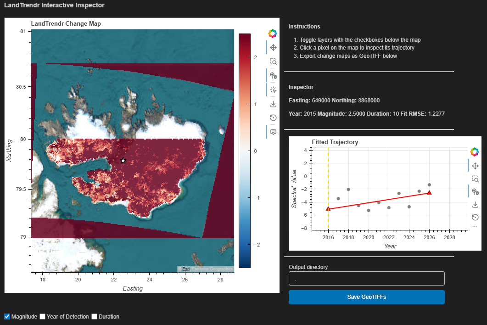
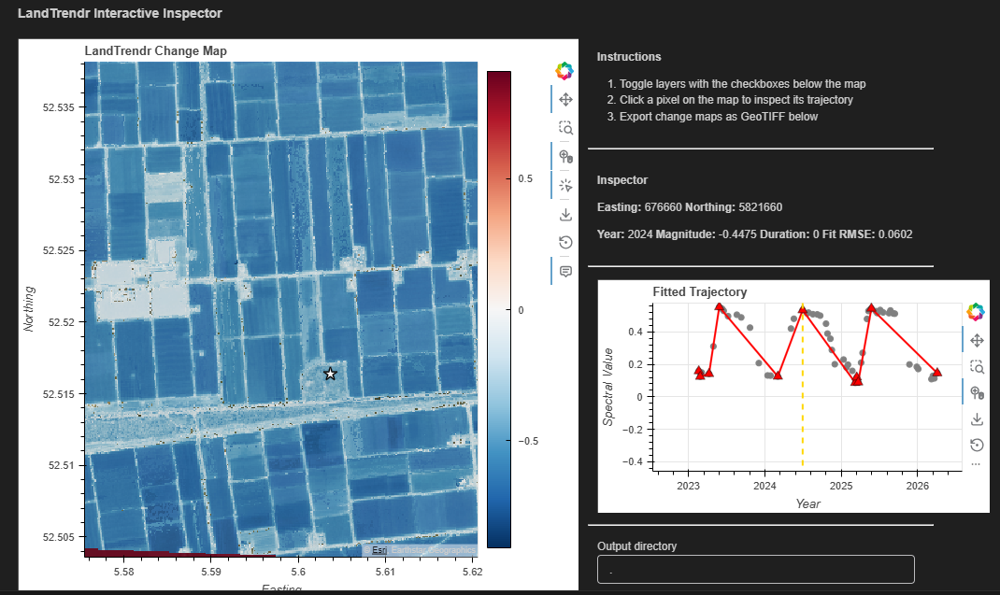

# Space-Time-DeepSearch: a Python library for cloud native satellite time series analysis and LandTrendr temporal segmentation

**Abstract** -- This report describes Space-Time-DeepSearch, an open source Python library for spatiotemporal analysis of satellite imagery. The library provides a single API for retrieving multi-sensor satellite data (Landsat, Sentinel-2, MODIS) through SpatioTemporal Asset Catalogs (STAC) and Cloud-Optimized GeoTIFFs (COG). It includes the first native Python implementation of the LandTrendr temporal segmentation algorithm (Kennedy et al., 2010). This implementation runs independently of Google Earth Engine, so users can inspect and modify every step, and plug results directly into standard Python workflows. We describe the library architecture, validate it against the GEE reference implementation, and show three use cases. Version 1.0 covers data extraction, LandTrendr segmentation, and interactive visualization.

---

## Table of contents

1. [Introduction](#1-introduction)
2. [Related work](#2-related-work)
3. [Architecture](#3-architecture)
4. [GEE vs native LandTrendr: a systematic comparison](#4-gee-vs-native-landtrendr-a-systematic-comparison)
5. [Use cases](#5-use-cases)
6. [Implementation](#6-implementation)
7. [Conclusions](#7-conclusions)
8. [References](#8-references)

---

## 1. Introduction

### 1.1 Research context

Satellite remote sensing is now a standard tool for monitoring environmental change at regional to global scales. Landsat covers over four decades of observations; Sentinel-2 has provided 10-meter resolution since 2015. Together they let researchers build dense time series that capture both abrupt events (deforestation, wildfire) and gradual ones (urbanization, glacial retreat).

At the same time, the geospatial community has moved toward cloud native data access. STAC and COG let analysts search, filter, and stream satellite imagery directly from cloud archives without downloading full scenes. Providers like Microsoft Planetary Computer, NASA Earthdata, and Element 84's Earth Search expose petabytes of data through standardized APIs. Combined with parallel computing libraries like Dask and labeled array frameworks like xarray, it is now feasible to run heavy time series analysis locally, on a researcher's own hardware, without depending on a managed cloud platform.

One algorithm that would benefit from this shift is LandTrendr (Kennedy et al., 2010), one of the most widely used temporal segmentation methods for land change detection. Its only production implementation lives inside Google Earth Engine (GEE). GEE's closed source, server side execution makes it impossible to step through the algorithm, modify its internals, or connect its outputs directly to Python tools like scikit-learn or PyTorch. If you want to change how compositing works, try a different vertex selection strategy, or feed segmentation results into a classifier, you have to export intermediate data and leave the GEE environment.

### 1.2 Motivation

Space-Time-DeepSearch fills three gaps:

1. **No native Python LandTrendr.** LandTrendr (Kennedy et al., 2010) is one of the most widely used algorithms for land change detection, but its only production implementation lives inside GEE. That means you can't step through it, modify vertex selection logic, or run it on your own hardware without exporting data first.

2. **Fragmented Python tooling.** Good libraries exist for individual tasks: `pystac-client` for catalog search, `stackstac` for lazy data cubes, `xarray` for labeled arrays, `rioxarray` for raster operations. Stitching them into a working satellite analysis pipeline still takes a lot of boilerplate and domain knowledge.

3. **No interactive Python time series exploration tool.** Interpreting temporal segmentation results means clicking on pixels, inspecting their raw trajectories, and understanding how the algorithm partitioned each time series. No open Python tool provides this. GEE's code editor has it, but only within GEE. Outside of that environment, validating or debugging a change map requires writing custom plotting code for every pixel you want to examine.

### 1.3 Research questions

1. Can a native Python pipeline, built on STAC and xarray, produce satellite data retrieval and temporal segmentation results comparable to Google Earth Engine?
2. How does a pure NumPy LandTrendr implementation, parallelized through `xr.apply_ufunc` and Dask, compare against GEE's server side processing in accuracy and flexibility?
3. What are the practical trade-offs between the two approaches for scalability, reproducibility, and extensibility?

### 1.4 Scope

Version 1.0 covers three things: (1) data extraction modules for Landsat, Sentinel-2, and MODIS with cloud aware filtering and temporal compositing; (2) a complete LandTrendr temporal segmentation engine with change map extraction; and (3) visualization tools including static plots, interactive pixel inspection, and timelapse animation. Future versions will add deep learning models for automated change classification.

---

## 2. Related work

### 2.1 LandTrendr temporal segmentation

Kennedy et al. (2010) introduced LandTrendr (Landsat-based Detection of Trends in Disturbance and Recovery) as a method for fitting piecewise linear models to annual Landsat time series. The algorithm finds breakpoints (vertices) in spectral trajectories, which can then be used to detect and characterize land surface change. It works in four stages: despiking to remove ephemeral anomalies, vertex identification to find candidate breakpoints, iterative model fitting from complex to simple, and statistical model selection via F-testing. Since publication, LandTrendr has been applied to forest disturbance mapping, post-fire recovery, urban expansion, and other change detection problems.

### 2.2 Google Earth Engine implementation

Kennedy et al. (2018) ported LandTrendr to GEE as `ee.Algorithms.TemporalSegmentation.LandTrendr`, making it available at cloud compute scale with direct access to GEE's Landsat archives. The LT-GEE version has been widely adopted for national and continental scale mapping. But because it runs server side, users cannot step through the algorithm, change internal logic, or integrate results with Python workflows without exporting data. GEE's compositing approach also differs from band level compositing: GEE computes the spectral index per scene and then takes the median, while computing the median of individual bands and then calculating the index produces different results because normalized difference indices are non-linear.

### 2.3 Cloud native geospatial standards

STAC provides a JSON-based specification for describing geospatial assets, so you can search across providers through a common API. COGs store GeoTIFF data with internal tiling and overviews, allowing HTTP range requests to read only the portions of a file that are actually needed. Microsoft Planetary Computer hosts Landsat Collection 2, Sentinel-2 L2A, and MODIS, all accessible through STAC. For many workflows, this is a practical alternative to GEE for data access.

### 2.4 The Python geospatial stack

Several Python libraries form the basis of modern cloud native geospatial analysis:

- **xarray** (Hoyer & Hamman, 2017) provides labeled, N-dimensional arrays with coordinate metadata (time, latitude, longitude) attached to NumPy arrays.
- **Dask** (Rocklin, 2015) adds lazy, parallel, and out-of-core computation to NumPy and pandas. Combined with xarray, it lets you work on datasets larger than memory by chunking arrays and processing them in parallel.
- **stackstac** builds lazy Dask-backed DataArrays from STAC search results, with automatic reprojection and mosaicing.
- **rioxarray** adds rasterio-based geospatial operations to xarray: CRS management, clipping to geometries, and reprojection.

### 2.5 Where Space-Time-DeepSearch fits

Space-Time-DeepSearch wraps these components into one library that handles the full pipeline from data discovery to temporal analysis and visualization. What sets it apart is the native Python LandTrendr: a pure NumPy kernel that you can read, test, debug at the pixel level, and modify. Because it operates on STAC data through xarray and Dask, the library does what GEE does for this class of problems while staying inside the open Python ecosystem.


*Figure 1: How Space-Time-DeepSearch connects cloud native data access (STAC/COG), the Python scientific stack (xarray/Dask), and temporal segmentation (LandTrendr) into one pipeline.*

---

## 3. Architecture

Space-Time-DeepSearch is organized into three layers: data ingestion (`io/`), temporal analysis (`temporal/`), and visualization (`vis/`). A `SpaceTimeDeepSearch` class in `core.py` exposes everything through a single API. It accepts an area of interest as a bounding box, custom geometry, or city name.

### 3.1 Data retrieval pipeline

The retrieval pipeline turns an area of interest and time range into an analysis-ready xarray DataArray with dimensions `(time, band, y, x)`. Three sensor-specific modules implement this for different data sources, all following the same pattern.

#### Supported data sources

| Module | Collection | Sensors | Resolution | Cloud masking |
|--------|-----------|---------|------------|---------------|
| `sentinel2.py` | Sentinel-2 L2A | MSI (13 bands) | 10 m | SCL classification layer |
| `landsat.py` | Landsat C2 L2 | TM, ETM+, OLI, OLI-2 | 30 m | QA_PIXEL bit flags |
| `modis.py` | MOD11A1 v061 | MODIS Terra | 1000 m | Not available in L2 LST |

#### Pipeline stages

The pipeline has eight stages. All are lazy until the final `.compute()` call:

1. **AOI definition.** The user supplies a bounding box `(west, south, east, north)` in WGS-84, a GeoJSON file path, a Shapely geometry, or a city name (geocoded via OpenStreetMap). The library picks the optimal UTM zone using `pyproj`.

2. **STAC catalog search.** The library queries Microsoft Planetary Computer via `pystac-client` with automatic SAS token signing through the `planetary-computer` modifier. Scenes are filtered by bounding box, date range, and coarse cloud cover metadata.

3. **Lazy data cube construction.** STAC items are assembled into a Dask-backed xarray DataArray with `stackstac.stack()`. This sets up references to Cloud-Optimized GeoTIFF URLs but downloads nothing yet. For Landsat, the parameter `rescale=False` is needed to prevent double application of scale factors already in the STAC item metadata.

4. **Geometry clipping.** For non-rectangular AOIs, the data cube is clipped to the target geometry with `rioxarray.clip()`. This is also lazy.

5. **Cloud and coverage filtering.** A two-pass filter removes bad scenes. First, cloud statistics are computed per scene: Sentinel-2 decodes SCL classes 3, 8, 9, 10; Landsat decodes QA_PIXEL bit flags (bits 1, 3, 4, 5). Quality arrays are downsampled 10:1 for large AOIs to speed this up. Scenes above the cloud cover threshold or below the minimum spatial coverage are dropped. Then pixel level cloud masking sets remaining cloudy pixels to NaN.

6. **Scale factor application.** Landsat Collection 2 Level-2 data needs conversion from digital numbers to surface reflectance using scale factor 0.0000275 and offset -0.2, then clipping to [0, 1]. An optional Spectral Response Function (SRF) correction (Roy et al., 2016) harmonizes TM and ETM+ reflectance to OLI-equivalent values.

7. **Temporal compositing.** Scenes are aggregated into regular time periods (monthly, annual, etc.) using median compositing, which handles residual cloud contamination well. An optional seasonal window restricts compositing to specific months (e.g., June through October for growing season analysis).

8. **Materialization.** The lazy computation graph runs via `.compute()`, downloading only the needed data tiles and producing an in-memory xarray DataArray.


*Figure 2: Data retrieval pipeline from AOI definition to materialized xarray DataArray. Everything between STAC search and `.compute()` is lazy -- no pixel data is downloaded until the final step.*

### 3.2 LandTrendr pixel level algorithm

The temporal segmentation engine implements Kennedy et al. (2010) as a pure NumPy kernel in `_landtrendr_core.py`. The kernel has no dependency on xarray, Dask, or any I/O framework. You can test it with plain array inputs, and it could be compiled with Numba if needed.

The algorithm takes a time series of annual spectral values for one pixel and returns a piecewise linear fitted trajectory with identified breakpoints (vertices). It has four stages:

#### Stage 1: Despiking

Single-year anomalies from residual cloud contamination, sensor noise, or atmospheric effects are identified and removed. For each interior point, the algorithm checks whether both neighbors deviate in the same direction (i.e., the point is a local spike). If the spike magnitude exceeds `spike_threshold` times the overall value range, the point is replaced with the average of its neighbors. Setting the threshold to 1.0 disables this step.

#### Stage 2: Vertex identification

Candidate breakpoints are local extrema, points where the direction of spectral change reverses. The first and last observations are always included. If there are too many candidates (more than `max_segments + 1 + vertex_count_overshoot`), an angle-based pruning strategy iteratively removes the vertex with the smallest deflection angle. The deflection angle measures how much the trajectory changes direction at that point; small angles mean minor inflections that don't contribute much to the overall shape.

#### Stage 3: Iterative model fitting

A sequence of models is generated from the most complex (all initial vertices) down to the simplest (two vertices, one straight line). At each step:

1. A piecewise linear curve is fitted through the current vertices using `np.interp`.
2. Recovery constraints are applied: if `prevent_one_year_recovery` is on, recovery segments spanning one year are flattened. If the recovery rate exceeds `recovery_threshold`, the segment endpoint is adjusted to cap it.
3. RMSE between the fitted curve and the despiked values is computed.
4. The interior vertex with the smallest deflection angle is removed, and the process repeats.

This produces candidate models ranging from `max_segments` segments down to 1.

#### Stage 4: Statistical model selection

The algorithm walks from the simplest to the most complex candidate and applies an F-test against the null model (single straight line). The first model that meets two conditions is selected: (1) its F-test p-value is below `pval_threshold`, and (2) its RMSE is within `best_model_proportion` of the best-fitting model's RMSE. If nothing qualifies, the simplest model wins. This implements a parsimony principle: prefer simpler explanations unless complexity is justified.

#### Change extraction

After segmentation, change metrics come from the fitted trajectory. Each pair of consecutive vertices defines a segment with: Year of Detection (YOD), magnitude, duration, pre-change value, rate (magnitude/duration), and delta signal-to-noise ratio (dSNR = |magnitude|/RMSE). A direction filter selects loss segments (negative spectral change, typically disturbance), gain segments (positive change, typically recovery), or both. A selection criterion picks the segment of interest: greatest magnitude, longest duration, steepest rate, or most recent.


*Figure 3: LandTrendr pixel level algorithm. The four stages turn a raw spectral time series into a piecewise linear trajectory with breakpoints. Change extraction then derives disturbance or recovery metrics from the fitted segments.*


*Figure 4: Example LandTrendr pixel trajectory. Gray dots are source spectral values, the red line is the piecewise linear fit, red triangles mark vertices. The dashed gold line marks the Year of Detection for the greatest loss segment.*

### 3.3 Image level disturbance maps and interactive inspector

#### Parallelized execution

The LandTrendr kernel operates on one pixel at a time, which is the natural unit of the algorithm but also its main scaling challenge. A satellite image contains millions of pixels, each requiring an independent segmentation run. The library addresses this through Dask's task graph model: the image is partitioned into spatial chunks, and xarray's apply mechanism maps the per-pixel function across all chunks in parallel, distributing the workload across available CPU cores. No pixel shares state with another, so the problem is embarrassingly parallel. The computation is also lazy — the segmentation graph is built before any data is downloaded, and only triggers actual execution when the result is requested. Sub-annual observations are first reduced to one value per year via grouped median compositing, since LandTrendr expects an annual time series.

The result is a labeled dataset containing, for each pixel, the original spectral trajectory, the piecewise linear fitted curve, a boolean breakpoint mask, and the fit error. These arrays share the same spatial coordinates as the input, so they can be combined with other xarray data or written to disk without any coordinate bookkeeping.

#### Change map extraction

Once segmentation is complete, the change metrics are derived by scanning each pixel's fitted trajectory for segments that meet the chosen criteria. The same parallel approach applies: the extraction runs independently per pixel and distributes across Dask workers. The output is a spatial dataset where each variable (Year of Detection, magnitude, duration, pre-change value, rate, and delta signal-to-noise ratio) is a 2D map aligned to the input grid. Users control which segment is reported by selecting a direction (loss, gain, or all) and a selection criterion (greatest magnitude, longest duration, steepest rate, or most recent event).

#### Interactive inspector

The interactive inspector is built on HoloViews, Panel, and Bokeh, and runs inside a Jupyter notebook or as a standalone web application. It connects the spatial change maps to the underlying pixel trajectories, so a researcher can click any location on the map and immediately see the raw spectral values, the fitted curve, and the detected breakpoints for that pixel.

The interface has two main panels:

- **Map panel (left).** Three toggleable raster layers (magnitude, Year of Detection, duration) sit on top of an Esri satellite basemap. The library reprojects change maps from their native UTM CRS to Web Mercator (EPSG:3857) for basemap alignment. Each layer has its own colormap computed from valid data ranges, with adjustable transparency.

- **Inspection panel (right).** Clicking a pixel on the map triggers a coordinate transform from Web Mercator to the native CRS, pulls the corresponding time series, and renders a trajectory plot. The plot shows source values as scatter points, the piecewise linear fit, vertex markers, and a vertical line at the Year of Detection. Below the plot, a panel shows the pixel coordinates, YOD, magnitude, duration, and RMSE.

A GeoTIFF export button writes each change map variable as a georeferenced raster via `rioxarray.rio.to_raster()`, preserving the original CRS.


*Figure 5: Image level processing pipeline. From spectral index input through parallelized LandTrendr, change map extraction, and the three visualization outputs. The interactive inspector (highlighted) lets you click any pixel to see its trajectory.*


*Figure 6: The LandTrendr Interactive Inspector. Left: magnitude change map on an Esri satellite basemap with toggleable YOD and duration layers. Right: trajectory plot for the selected pixel (white star) with source values, fitted line, vertices, and Year of Detection (dashed gold). Coordinates and metrics are shown below.*

---

## 4. GEE vs native LandTrendr: a systematic comparison

We compared the native Python implementation against Google Earth Engine LandTrendr (LT-GEE) to check whether the results are consistent. Both implementations are based on Kennedy et al. (2010) but differ in data source, compositing method, index orientation, scale handling, and cloud masking.

### 4.1 Comparison setup

We picked two ecologically distinct test sites:

| Site | Coordinates | Expected change |
|------|------------|-----------------|
| Oregon forest | -122.8848, 43.7929 | Abrupt disturbance around 1997 (harvest or fire) |
| Brazil mining | -56.61152, -6.84313 | Continuous degradation from mining |

Both sides used the same LandTrendr parameters: `max_segments=6`, `spike_threshold=0.9`, `recovery_threshold=0.25`, `pval_threshold=0.25`, `best_model_proportion=0.75`. The index was NBR (Normalized Burn Ratio) over 1985-2024, with cross-sensor harmonization turned off on both sides for a fair comparison.

The structural differences between the two:

| Factor | Native | GEE |
|--------|--------|-----|
| Compositing | `NBR(median(NIR), median(SWIR2))` | `median(NBR per scene)` |
| Scale | float64 [-1, 1] | int16 (x1000) |
| Cloud masking | Scene level + pixel level | Pixel level only |

The compositing order matters most. Since the normalized difference is nonlinear, computing the median of individual bands and then calculating NBR gives different results from computing NBR per scene and then taking the median.

### 4.2 Findings

#### Pixel level agreement

At both sites, the native and GEE implementations detect the same disturbance events:

- **Oregon forest.** Pearson r = 0.93 between fitted trajectories. Both identify the roughly 1997 disturbance (YOD = 1996) with 1-year duration. The native implementation measures a slightly larger magnitude (-0.81 vs -0.60), consistent with the compositing order difference.

- **Brazil mining.** Pearson r = 0.72. Both capture the long-term degradation trend with similar magnitudes (-0.36 vs -0.34). They differ in segment choice: GEE fits a 2-vertex model over the full 39-year decline, while the native version picks out a recent steep segment.


*Figure 7: Native (red) and GEE (blue) fitted NBR trajectories at the Oregon forest pixel. Both detect the roughly 1997 disturbance.*

#### Spatial change map agreement

Over approximately 3 km areas at each site:

| Metric | Oregon forest | Brazil mining |
|--------|--------------|---------------|
| Pixel trajectory r | 0.93 | 0.72 |
| YOD spatial r | 0.67 | 0.53 |
| YOD agreement (+-1 yr) | 64.2% | 50.0% |
| Magnitude spatial r | 0.83 | 0.67 |
| Duration spatial r | 0.38 | 0.22 |
| Mean YOD (native / GEE) | 2003.8 / 2004.0 | 1996.8 / 1996.0 |

Mean YOD values show no systematic timing bias at either site. The native implementation consistently detects slightly larger magnitudes, which follows from the compositing order effect. Duration has lower correlation because small differences in vertex placement change segment length a lot, especially at sites with gradual change.


*Figure 8: Change map comparison at the Oregon forest site. Rows: Native, GEE, Difference. Columns: Year of Detection, Magnitude, Duration. Difference maps use a diverging colormap centered on zero.*


*Figure 9: Native (y-axis) vs. GEE (x-axis) scatter plots for Year of Detection, Magnitude, and Duration. Oregon in green, Brazil in orange. Dashed line is 1:1.*

### 4.3 Sources of divergence

Three factors explain the remaining differences:

**Compositing order.** This is the main one. The native approach computes `NBR(median(NIR), median(SWIR2))`; GEE computes `median(NBR_scene)`. Because the normalized difference is nonlinear, these give systematically different composite values. The effect is strongest when within-season spectral variability is high, and it explains the consistent magnitude offset.

**Cloud masking scope.** The native implementation rejects entire scenes above a cloud percentage threshold and also does pixel level QA masking. GEE does pixel level masking only. Different scenes can end up in the annual composites, so the input time series differ.

**Numerical precision.** GEE works with scaled int16 values (NBR x 1000), which introduces a quantization floor of 0.001 in NBR units. The native implementation uses float64 throughout. Individually these rounding differences are small, but they can shift vertex placement during pruning.

### 4.4 Recommendations

| Use case | Recommended | Why |
|----------|------------|-----|
| Large area mapping (national/continental) | GEE | Cloud compute, no download/storage needed |
| Integration with Python tools | Native | Direct xarray/Dask workflow, composable |
| Custom spectral indices or compositing | Native | Full control over every processing step |
| Reproducing published GEE studies | GEE | Exact match with original methods |
| Offline or air-gapped environments | Native | Only needs STAC access or local data |
| Teaching or debugging | Native | Transparent pure NumPy kernel, step-through |

---

## 5. Use cases

### 5.1 Deforestation monitoring (Landsat)

Deforestation is the most common use case for LandTrendr, and the one it was originally designed for. Landsat's four-decade archive at 30-meter resolution makes it the natural data source for this kind of analysis. Abrupt canopy loss -- clear-cuts, fire scars, selective logging -- produces sharp drops in vegetation indices like NBR that the piecewise linear model captures naturally: a long stable segment, a steep loss segment, and a gradual recovery segment.

Figure 6 shows a typical deforestation analysis using the interactive inspector. The magnitude change map highlights areas of forest loss across the landscape, and clicking any pixel reveals its full spectral history, showing exactly when the forest was cleared and how recovery has progressed.

For deforestation monitoring, the following parameters work well as defaults:

| Parameter | Value | Rationale |
|-----------|-------|-----------|
| `max_segments` | 6 | Captures disturbance + recovery + secondary events |
| `spike_threshold` | 0.9 | Moderate despiking for noisy tropical composites |
| `recovery_threshold` | 0.25 | Prevents unrealistic recovery rates |
| `prevent_one_year_recovery` | True | Real forest recovery takes multiple years |
| `pval_threshold` | 0.05 | Stricter significance for confident detections |
| `best_model_proportion` | 0.75 | Balances fit quality with parsimony |
| `min_observations_needed` | 6 | Enough data points for reliable fitting |
| Spectral index | NBR | Most sensitive to canopy structure changes |
| Composite window | Jun--Oct (temperate) or dry season (tropical) | Minimizes cloud contamination |
| Change type | `greatest`, `delta_filter="loss"` | Targets the largest disturbance event |

### 5.2 Climate change -- ice decrease in Svalbard (MODIS)

Monitoring glacial retreat through Land Surface Temperature (LST) is another use case where LandTrendr works well. The library's MODIS module retrieves MOD11A1 daily LST at 1 km resolution, which can be composited into annual time series and fed into LandTrendr. As ice cover decreases, exposed rock and water absorb more solar radiation, producing a measurable upward trend in surface temperature over decades.


*Figure 10: LandTrendr Interactive Inspector applied to Svalbard using MODIS LST. The magnitude change map (left) highlights areas of temperature increase along glacier margins and coastlines. The pixel trajectory (right) shows a gradual upward LST trend consistent with ice retreat and surface warming.*

The pixel trajectory in Figure 10 shows a gradual upward temperature trend rather than an abrupt break, which is typical for glacial retreat -- the warming accumulates over years. One important difference from deforestation: rising LST represents a *gain* in the input signal, so the change map extraction must use `delta_filter="gain"` instead of `"loss"`:

```python
change = stds.extract_change_map(lt_result, change_type="greatest", delta_filter="gain")
```

### 5.3 Phenological cycles in Flevoland (Sentinel-2)

Sentinel-2's 10-meter resolution and 5-day revisit make it a great fit for agricultural monitoring. We tried applying LandTrendr to phenological analysis -- tracking the seasonal cycle of green-up, peak growth, and senescence over cropland -- but it does not work well for this. LandTrendr looks for long-term trends in annual composites, so it misses within-year dynamics entirely. When we ran it over agricultural fields, the change maps came out meaningless: the YOD and magnitude values just picked up compositing noise and crop rotation between years, not any real landscape change.


*Figure 11: LandTrendr Interactive Inspector applied to Sentinel-2 imagery over agricultural fields in Flevoland, the Netherlands. The change map (left) shows magnitude values over crop parcels that do not correspond to meaningful change events. The pixel trajectory (right) still provides useful visualization of annual spectral values.*

Figure 11 shows the library applied to Flevoland. The rectangular field patterns are visible in the change map, but the spatial patterns reflect crop rotation rather than disturbance or recovery. The change metrics have no useful interpretation for annually harvested cropland.

The interactive inspector remains useful even here -- the pixel trajectory can reveal whether a field has been consistently cultivated, converted to another use, or left fallow. But for actual phenological analysis, dedicated tools are better suited. Savitzky-Golay filtering (Savitzky & Golay, 1964) and libraries like TIMESAT (Jonsson & Eklundh, 2004) are designed specifically for extracting phenological metrics (start-of-season, peak greenness, senescence) from dense sub-annual time series, which is the temporal resolution that phenological questions require.

---

## 6. Implementation

### 6.1 Installation

Install via pip:

```bash
pip install space-time-deepsearch
```

For development and testing:

```bash
git clone https://github.com/your-org/space-time-deepsearch.git
cd space-time-deepsearch
poetry install --with dev
```

The library requires Python 3.11 or 3.12. On Windows, a known PROJ database conflict with PostgreSQL/PostGIS installations is handled automatically at import time.

### 6.2 Quick start

A complete LandTrendr workflow in six lines:

```python
from space_time_deepsearch import SpaceTimeDeepSearch

# Define area of interest
stds = SpaceTimeDeepSearch(city="Enschede, Netherlands")

# Retrieve annual Landsat NBR composites (1985-2024)
landsat = stds.get_landsat(
    start_date="1985-01-01", end_date="2024-12-31",
    bands=["nir08", "swir22"], add_nbr=True,
    cloud_cover_max=20, mask_clouds=True,
    composite_period="1Y",
    composite_start="06-01", composite_end="10-31",
)

# Extract NBR band and run LandTrendr
nbr = landsat.sel(band="NBR", drop=True)
lt_result = stds.run_landtrendr(nbr)

# Generate change map and launch interactive inspector
change = stds.extract_change_map(lt_result, change_type="greatest", delta_filter="loss")
stds.inspect_landtrendr(lt_result, change)
```

### 6.3 Documentation and notebooks

> **[Placeholder]** API reference documentation will be generated with mkdocs-material and mkdocstrings and published online. Jupyter notebooks with complete workflows for each use case (deforestation, ice retreat, phenology) will be in the repository's `notebooks/` directory.

---

## 7. Conclusions

### 7.1 What we built

Space-Time-DeepSearch is a Python library that brings cloud native satellite time series analysis and LandTrendr temporal segmentation into the open Python ecosystem. The main contributions:

1. **First native Python LandTrendr.** Validated against the GEE reference with pixel level trajectory correlations of r = 0.72-0.93 and spatial Year of Detection agreement of 50-64% within +-1 year across two ecologically distinct test sites.

2. **Single API for multi-sensor data retrieval** from Landsat, Sentinel-2, and MODIS through STAC and COGs, with cloud aware filtering, temporal compositing, and spectral index calculation, all lazy via Dask.

3. **Interactive pixel level inspection** that lets researchers explore change maps and examine individual trajectories in a browser based dashboard.

4. **Transparent algorithm kernel** in pure NumPy, suitable for unit testing, teaching, and potential JIT compilation.

### 7.2 Trade-offs

The native implementation gives you flexibility, reproducibility, and access to the full Python scientific stack. You can change compositing strategies, add custom indices, or embed LandTrendr in a larger pipeline. GEE is still better for large area mapping at national or continental scales, where server side processing avoids the need for local compute and data transfer.

### 7.3 What comes next

Several directions are planned:

- **Deep learning.** The library already includes PyTorch as a dependency, anticipating learned change classifiers that operate on LandTrendr-derived features.
- **More temporal algorithms.** Other segmentation methods (BFAST, CCDC) could be added as alternative kernels within the same xarray framework.
- **More data sources.** Integration with additional STAC providers and datasets (Sentinel-1 SAR, ERA5 climate reanalysis) would broaden what the library can do.
- **QGIS plugin.** A graphical interface for non-programmers, allowing interactive LandTrendr analysis within QGIS.

---

## 8. References

- Hoyer, S., & Hamman, J. (2017). xarray: N-D labeled arrays and datasets in Python. *Journal of Open Research Software*, 5(1), 10.

- Kennedy, R. E., Yang, Z., & Cohen, W. B. (2010). Detecting trends in forest disturbance and recovery using yearly Landsat time series: 1. LandTrendr -- Temporal segmentation algorithms. *Remote Sensing of Environment*, 114(12), 2897-2910.

- Kennedy, R. E., Yang, Z., Gorelick, N., Braaten, J., Cavalcante, L., Cohen, W. B., & Healey, S. (2018). Implementation of the LandTrendr algorithm on Google Earth Engine. *Remote Sensing*, 10(5), 691.

- Rocklin, M. (2015). Dask: Parallel computation with blocked algorithms and task scheduling. *Proceedings of the 14th Python in Science Conference*, 126-132.

- Roy, D. P., Kovalskyy, V., Zhang, H. K., Vermote, E. F., Yan, L., Kumar, S. S., & Egorov, A. (2016). Characterization of Landsat-7 to Landsat-8 reflective wavelength and normalized difference vegetation index continuity. *Remote Sensing of Environment*, 185, 57-70.

- STAC Specification. (2021). SpatioTemporal Asset Catalog specification. https://stacspec.org

---

*Report generated for Space-Time-DeepSearch v1.0. Author: David Reyes.*
